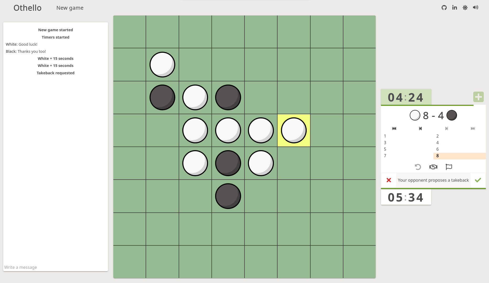
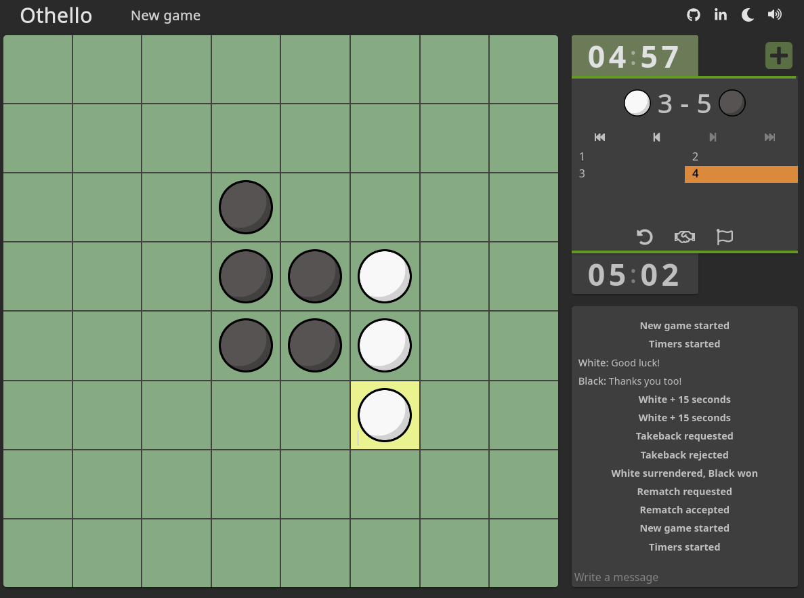

### Othello game

Challenge your friends to an intense game of list and cunning :grinning:

#### Demo: Challenge your friends! [Play](https://othello-frontend.fly.dev/)

#### Screenshots

  

#### How to play: 
1) The game starts with two black discs and two white discs placed diagonally in the center of the board

2) Players take turns placing their discs on the board, with the black player making the first move.

3) When making a move, players must place their disc in a position that surrounds at least one of their opponent's discs horizontally, vertically, or diagonally. The squares where you can place a disc are highlighted.

Remember, the game continues with players taking turns, strategically placing their discs to surround and capture their opponent's discs. The player with the most discs of their color on the board at the end of the game wins.

#### Technology Stack
Svelte, .NET and websockets

#### Features :sparkles:
- Dark mode :waxing_crescent_moon:
- Move history, seamlessly browse past game states
- Accurate multiplayer timer with increments
- Player actions, like takeback requests and draw offer
- Live chat
- Responsive design :dancer:

#### Contact Information
email: elmer.lingestal@live.se
linkeldn: [www.linkeldn.com](https://www.linkedin.com/in/elmer-lingest%C3%A5l-3571021a8/)
