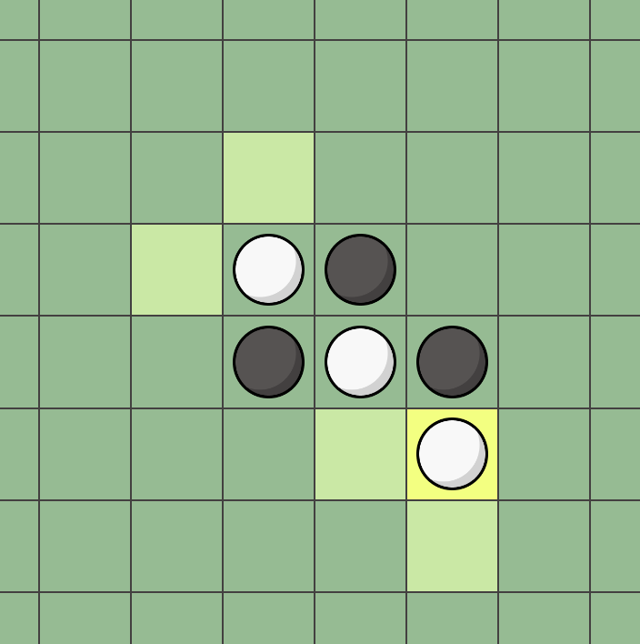

## Othello game :game_die:
Immerse yourself in a timeless strategic duel and challenge your friends to an engaging game of wit and cunning.

### Experience the thrill! [Play Now :rocket:](https://othello-frontend.fly.dev/)

### Screenshots

  

### How to play
Embark on the Othello journey with these simple steps:

1. The battle commences with two black discs and two white discs placed diagonally in the center of the 8x8 grid.

2. Players alternate turns, starting with the black side. Lay your disc on the board to capture your opponent's pieces.

3. To make a valid move, place your disc such that it sandwiches at least one of your opponent's discs horizontally, vertically, or diagonally. Valid move positions are highlighted for your convenience.

The contest continues with players plotting and executing their strategies. The player dominating the board with the most discs of their color at the end claims victory!

Remember, the game continues with players taking turns, strategically placing their discs to surround and capture their opponent's discs. The player with the most discs of their color on the board at the end of the game wins.

### Technology Stack :wrench:
This project employs <b>Svelte</b> for creating interactive user interfaces, <b>.NET</b> for backend operations, and <b>websockets</b> for real-time bidirectional communication. The integration of these technologies delivers a swift and immersive gaming experience.

### Features :star2:
- Dark Mode: Switch to a dark-themed interface for an eye-friendly gaming experience. :waxing_crescent_moon:
- Move History: Browse past game states seamlessly and strategize your next move. :arrow_backward:
- Multiplayer Timer: Keep track of your game progress with an accurate multiplayer timer with increments. :hourglass_flowing_sand:
- Player Actions: Engage in fair play with features like takeback requests. :handshake:
- Live Chat: Communicate in real-time with your opponent. :speech_balloon:
- Responsive Design: Enjoy smooth gameplay on any device with our responsive design. :iphone:

### Get in Touch
Email: elmer.lingestal@live.se
Linkeldn: [Elmer Lingestål](https://www.linkedin.com/in/elmer-lingest%C3%A5l-3571021a8/)
